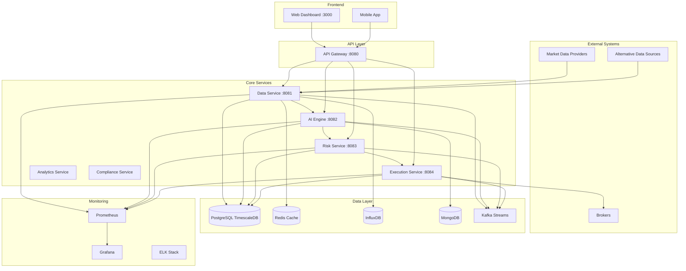
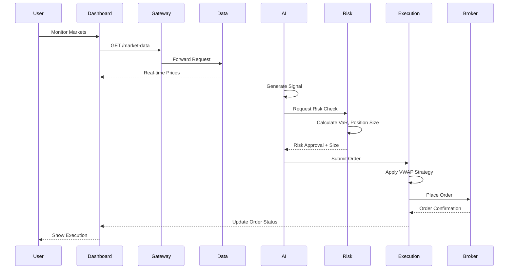
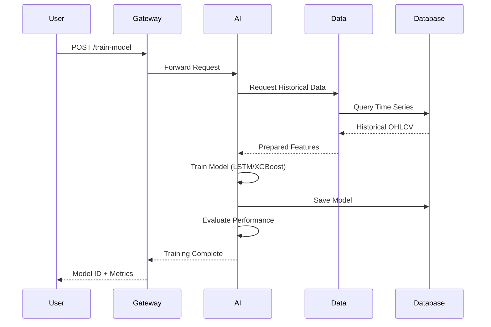

# Architecture

## Overview

QuantumAlpha follows a microservices architecture designed for scalability, resilience, and low-latency operations. This document provides a high-level overview of the system design and component mapping.

---

## Table of Contents

- [System Architecture](#system-architecture)
- [Component Diagram](#component-diagram)
- [Data Flow](#data-flow)
- [Module Mapping](#module-mapping)
- [Technology Stack](#technology-stack)
- [Deployment Architecture](#deployment-architecture)

---

## System Architecture

### High-Level Architecture



### Layered Architecture

| Layer                    | Components                     | Responsibilities                               |
| ------------------------ | ------------------------------ | ---------------------------------------------- |
| **Presentation Layer**   | Web Dashboard, Mobile App      | User interaction, visualization                |
| **API Gateway**          | API Gateway Service            | Request routing, authentication, rate limiting |
| **Application Layer**    | Microservices                  | Business logic, data processing                |
| **Data Layer**           | Databases, Message Queues      | Data persistence, caching, streaming           |
| **Infrastructure Layer** | Docker, Kubernetes, Monitoring | Deployment, scaling, observability             |

---

## Component Diagram

### Service Architecture

```
┌─────────────────────────────────────────────────────────────────┐
│                         API Gateway :8080                        │
│  ┌───────────────┬────────────────┬──────────────────────────┐  │
│  │ Authentication │ Rate Limiting   │ Request Routing          │  │
│  └───────────────┴────────────────┴──────────────────────────┘  │
└──────────────────────────┬──────────────────────────────────────┘
                           │
         ┌─────────────────┼─────────────────┬─────────────────┐
         │                 │                 │                 │
         ▼                 ▼                 ▼                 ▼
┌────────────────┐ ┌────────────────┐ ┌────────────────┐ ┌────────────────┐
│  Data Service  │ │   AI Engine    │ │  Risk Service  │ │   Execution    │
│     :8081      │ │     :8082      │ │     :8083      │ │   Service      │
│                │ │                │ │                │ │     :8084      │
│ ┌────────────┐ │ │ ┌────────────┐ │ │ ┌────────────┐ │ │ ┌────────────┐ │
│ │  Market    │ │ │ │   Model    │ │ │ │    Risk    │ │ │ │   Order    │ │
│ │   Data     │ │ │ │  Manager   │ │ │ │ Calculator │ │ │ │  Manager   │ │
│ └────────────┘ │ │ └────────────┘ │ │ └────────────┘ │ │ └────────────┘ │
│ ┌────────────┐ │ │ ┌────────────┐ │ │ ┌────────────┐ │ │ ┌────────────┐ │
│ │Alternative │ │ │ │Prediction  │ │ │ │  Position  │ │ │ │  Execution │ │
│ │    Data    │ │ │ │  Service   │ │ │ │   Sizing   │ │ │ │  Strategy  │ │
│ └────────────┘ │ │ └────────────┘ │ │ └────────────┘ │ │ └────────────┘ │
│ ┌────────────┐ │ │ ┌────────────┐ │ │ ┌────────────┐ │ │ ┌────────────┐ │
│ │  Feature   │ │ │ │     RL     │ │ │ │   Stress   │ │ │ │   Broker   │ │
│ │Engineering │ │ │ │  Service   │ │ │ │  Testing   │ │ │ │Integration │ │
│ └────────────┘ │ │ └────────────┘ │ │ └────────────┘ │ │ └────────────┘ │
└────────────────┘ └────────────────┘ └────────────────┘ └────────────────┘
         │                 │                 │                 │
         └─────────────────┴─────────────────┴─────────────────┘
                                    │
                    ┌───────────────┴───────────────┐
                    │         Data Layer            │
                    │  PostgreSQL  Redis  InfluxDB  │
                    │  MongoDB  Kafka               │
                    └───────────────────────────────┘
```

---

## Data Flow

### Real-Time Trading Flow



### Model Training Flow



---

## Module Mapping

### Backend Services

| Service                | Directory                     | Port | Key Files                                                                          | Dependencies                      |
| ---------------------- | ----------------------------- | ---- | ---------------------------------------------------------------------------------- | --------------------------------- |
| **API Gateway**        | `backend/api_gateway/`        | 8080 | `app.py`                                                                           | Flask, Flask-CORS                 |
| **Data Service**       | `backend/data_service/`       | 8081 | `app.py`, `alternative_data.py`, `feature_engineering.py`                          | pandas, yfinance, alpha-vantage   |
| **AI Engine**          | `backend/ai_engine/`          | 8082 | `app.py`, `model_manager.py`, `prediction_service.py`, `reinforcement_learning.py` | TensorFlow, PyTorch, scikit-learn |
| **Risk Service**       | `backend/risk_service/`       | 8083 | `app.py`, `risk_calculator.py`, `position_sizing.py`                               | scipy, statsmodels                |
| **Execution Service**  | `backend/execution_service/`  | 8084 | `app.py`, `order_manager.py`, `execution_strategy.py`, `broker_integration.py`     | alpaca-trade-api                  |
| **Analytics Service**  | `backend/analytics_service/`  | 8085 | `factor_analysis.py`, `performance_attribution.py`                                 | pandas, numpy                     |
| **Compliance Service** | `backend/compliance_service/` | 8086 | `compliance_monitoring.py`, `regulatory_reporting.py`                              | pandas, reportlab                 |

### Common Modules

| Module             | File                               | Purpose                       |
| ------------------ | ---------------------------------- | ----------------------------- |
| **Configuration**  | `backend/common/config.py`         | Centralized config management |
| **Database**       | `backend/common/database.py`       | Database connection pooling   |
| **Authentication** | `backend/common/auth.py`           | JWT authentication            |
| **Validation**     | `backend/common/validation.py`     | Request validation schemas    |
| **Logging**        | `backend/common/logging_config.py` | Structured logging            |
| **Monitoring**     | `backend/common/monitoring.py`     | Prometheus metrics            |
| **Messaging**      | `backend/common/messaging.py`      | Kafka pub/sub                 |
| **Models**         | `backend/common/models.py`         | Database ORM models           |
| **Utils**          | `backend/common/utils.py`          | Utility functions             |
| **Audit**          | `backend/common/audit.py`          | Audit trail logging           |

### Frontend Components

| Component            | Directory                             | Framework          | Purpose              |
| -------------------- | ------------------------------------- | ------------------ | -------------------- |
| **Web Dashboard**    | `web-frontend/src/`                   | React + TypeScript | Main web interface   |
| **Mobile App**       | `mobile-frontend/src/`                | React Native       | iOS/Android app      |
| **UI Components**    | `web-frontend/src/components/`        | Material-UI        | Reusable UI elements |
| **State Management** | `web-frontend/src/store/`             | Redux Toolkit      | Global state         |
| **API Client**       | `web-frontend/src/services/`          | Axios              | API communication    |
| **Charts**           | `web-frontend/src/components/charts/` | D3.js, Plotly      | Visualizations       |

---

## Technology Stack

### Backend Technologies

```
Application Layer:
├── Python 3.10+ (Primary language)
├── Flask 2.3 (Web framework)
├── Gunicorn (WSGI server)
└── Celery (Task queue)

Machine Learning:
├── TensorFlow 2.x (Deep learning)
├── PyTorch (Deep learning)
├── scikit-learn (Traditional ML)
└── Ray (Distributed training)

Data Processing:
├── pandas (Data manipulation)
├── NumPy (Numerical computing)
├── Dask (Parallel processing)
└── Apache Spark (Big data processing)

Financial Libraries:
├── QuantLib (Quantitative finance)
├── Backtrader (Backtesting)
├── PyPortfolioOpt (Portfolio optimization)
└── TA-Lib (Technical analysis)
```

### Frontend Technologies

```
Web Frontend:
├── React 18 (UI framework)
├── TypeScript (Type safety)
├── Material-UI (Component library)
├── Redux Toolkit (State management)
├── D3.js (Visualizations)
└── Plotly (Interactive charts)

Mobile Frontend:
├── React Native (Mobile framework)
├── TypeScript
└── React Navigation
```

### Data Storage

```
Databases:
├── PostgreSQL 14 + TimescaleDB (Relational + time series)
├── Redis 7 (Cache + sessions)
├── InfluxDB 2.x (Time series metrics)
└── MongoDB (Document storage)

Message Broker:
└── Apache Kafka 7.3 (Event streaming)
```

### Infrastructure

```
Containerization:
├── Docker (Containers)
└── Docker Compose (Local orchestration)

Orchestration:
├── Kubernetes (Production deployment)
└── Helm (Package manager)

Monitoring:
├── Prometheus (Metrics)
├── Grafana (Dashboards)
└── ELK Stack (Logs)

CI/CD:
├── GitHub Actions (Automation)
├── Terraform (Infrastructure as Code)
└── Ansible (Configuration management)
```

---

## Deployment Architecture

### Local Development

```
┌─────────────────────────────────────────┐
│         Developer Workstation            │
│  ┌────────────────────────────────────┐  │
│  │     Docker Compose                  │  │
│  │  ┌──────────┬──────────┬─────────┐ │  │
│  │  │ Services │ Databases │ Queues  │ │  │
│  │  └──────────┴──────────┴─────────┘ │  │
│  └────────────────────────────────────┘  │
│  ┌────────────────────────────────────┐  │
│  │    Python venv + Node.js           │  │
│  └────────────────────────────────────┘  │
└─────────────────────────────────────────┘
```

### Staging/Production (Kubernetes)

```
┌─────────────────────────────────────────────────────────┐
│                  Kubernetes Cluster                      │
│                                                          │
│  ┌────────────────────────────────────────────────────┐ │
│  │              Ingress Controller                     │ │
│  │         (Load Balancer + SSL Termination)          │ │
│  └────────────────────────────────────────────────────┘ │
│                          │                              │
│      ┌───────────────────┴───────────────────┐         │
│      │                                        │         │
│  ┌───▼──────────┐  ┌─────────────┐  ┌───────▼──────┐  │
│  │   Services   │  │   Services  │  │   Services   │  │
│  │   (Pods)     │  │   (Pods)    │  │   (Pods)     │  │
│  │ ┌──────────┐ │  │┌──────────┐ │  │┌──────────┐  │  │
│  │ │Data Svc  │ │  ││AI Engine │ │  ││Risk Svc  │  │  │
│  │ │x3 replicas│ │  ││x2 replicas│ │  ││x2 replicas│ │  │
│  │ └──────────┘ │  │└──────────┘ │  │└──────────┘  │  │
│  └──────────────┘  └─────────────┘  └──────────────┘  │
│                          │                              │
│  ┌──────────────────────▼──────────────────────────┐   │
│  │          StatefulSets (Databases)               │   │
│  │  ┌──────────┬──────────┬──────────┬──────────┐ │   │
│  │  │PostgreSQL│  Redis   │InfluxDB  │  Kafka   │ │   │
│  │  │(Primary  │          │          │(3 nodes) │ │   │
│  │  │+Replicas)│          │          │          │ │   │
│  │  └──────────┴──────────┴──────────┴──────────┘ │   │
│  └─────────────────────────────────────────────────┘   │
│                                                         │
│  ┌─────────────────────────────────────────────────┐   │
│  │        Monitoring Stack (DaemonSet)             │   │
│  │   Prometheus + Grafana + ELK                   │   │
│  └─────────────────────────────────────────────────┘   │
└─────────────────────────────────────────────────────────┘
                          │
                          ▼
┌─────────────────────────────────────────────────────────┐
│              Persistent Storage (EBS/GCE PD)             │
└─────────────────────────────────────────────────────────┘
```

### Network Architecture

```
                    Internet
                       │
                       ▼
            ┌──────────────────┐
            │  Load Balancer   │
            │    (AWS ALB/     │
            │    GCP GLB)      │
            └─────────┬────────┘
                      │
         ┌────────────┴────────────┐
         │                         │
    ┌────▼─────┐            ┌─────▼────┐
    │   DMZ    │            │   DMZ    │
    │(Frontend)│            │  (API)   │
    └────┬─────┘            └─────┬────┘
         │                         │
         └────────────┬────────────┘
                      │
              ┌───────▼────────┐
              │  Private Subnet │
              │  (Services)     │
              └───────┬─────────┘
                      │
              ┌───────▼────────┐
              │  Data Subnet   │
              │  (Databases)   │
              └────────────────┘
```

---

## Communication Patterns

### Synchronous Communication (REST API)

```
Client → API Gateway → Service → Database
         (HTTP/HTTPS)
```

### Asynchronous Communication (Kafka)

```
Service A → Kafka Topic → Service B
          (Event Stream)
```

### WebSocket (Real-time Updates)

```
Client ←─── WebSocket ───→ Service
        (Bidirectional)
```

---

## Scalability Considerations

| Component             | Scaling Strategy             | Current Limit          | Target Capacity        |
| --------------------- | ---------------------------- | ---------------------- | ---------------------- |
| **API Gateway**       | Horizontal (Kubernetes HPA)  | 3 replicas             | 10 replicas            |
| **Data Service**      | Horizontal + caching         | 3 replicas             | 20 replicas            |
| **AI Engine**         | Vertical (GPU) + horizontal  | 2 replicas             | 5 replicas             |
| **Risk Service**      | Horizontal                   | 2 replicas             | 10 replicas            |
| **Execution Service** | Horizontal + rate limiting   | 2 replicas             | 5 replicas             |
| **PostgreSQL**        | Read replicas + partitioning | 1 primary + 2 replicas | 1 primary + 5 replicas |
| **Redis**             | Redis Cluster                | 1 instance             | 6-node cluster         |
| **Kafka**             | Add brokers + partitions     | 1 broker               | 3-broker cluster       |

---

## Security Architecture

```
┌────────────────────────────────────────────┐
│            Security Layers                  │
│                                             │
│  1. Network Security                        │
│     ├── Firewall rules                     │
│     ├── VPC isolation                      │
│     └── Private subnets                    │
│                                             │
│  2. API Security                            │
│     ├── JWT authentication                 │
│     ├── Rate limiting                      │
│     ├── Input validation                   │
│     └── CORS policies                      │
│                                             │
│  3. Data Security                           │
│     ├── Encryption at rest                 │
│     ├── Encryption in transit (TLS)        │
│     ├── Database access controls           │
│     └── Secrets management (Vault)         │
│                                             │
│  4. Application Security                    │
│     ├── Code scanning (SAST)               │
│     ├── Dependency scanning (SCA)          │
│     ├── Container scanning                 │
│     └── Penetration testing                │
│                                             │
│  5. Monitoring & Audit                      │
│     ├── Access logs                        │
│     ├── Audit trails                       │
│     ├── Intrusion detection                │
│     └── Security alerts                    │
└────────────────────────────────────────────┘
```

---

## File Structure

```
QuantumAlpha/
├── backend/
│   ├── ai_engine/
│   │   ├── app.py
│   │   ├── model_manager.py
│   │   ├── prediction_service.py
│   │   └── reinforcement_learning.py
│   ├── analytics_service/
│   ├── api_gateway/
│   ├── common/
│   │   ├── auth.py
│   │   ├── config.py
│   │   ├── database.py
│   │   ├── logging_config.py
│   │   ├── models.py
│   │   ├── monitoring.py
│   │   └── validation.py
│   ├── compliance_service/
│   ├── config_files/
│   │   ├── database/
│   │   └── services/
│   ├── data_service/
│   ├── execution_service/
│   └── risk_service/
├── web-frontend/
│   └── src/
│       ├── components/
│       ├── pages/
│       ├── services/
│       └── store/
├── mobile-frontend/
├── infrastructure/
│   ├── kubernetes/
│   ├── terraform/
│   └── monitoring/
├── scripts/
├── tests/
│   ├── unit/
│   ├── integration/
│   └── system/
├── docs/
├── docker-compose.yml
└── README.md
```

---

**See Also:**

- [FEATURE_MATRIX.md](./FEATURE_MATRIX.md) - Complete feature list
- [API.md](./API.md) - API endpoints
- [CONFIGURATION.md](./CONFIGURATION.md) - Configuration options
