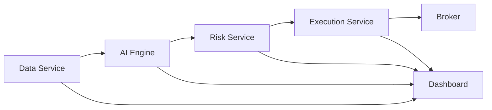

# Usage Guide

## Overview

This guide covers typical usage patterns for QuantumAlpha, including CLI operations, library usage, and common workflows.

---

## Table of Contents

- [Basic Concepts](#basic-concepts)
- [CLI Usage](#cli-usage)
- [Python Library Usage](#python-library-usage)
- [Common Workflows](#common-workflows)
- [API Client Examples](#api-client-examples)
- [Best Practices](#best-practices)

---

## Basic Concepts

### Core Workflow

QuantumAlpha follows a typical quantitative trading workflow:

```
Data Ingestion → Feature Engineering → Model Training →
Signal Generation → Risk Analysis → Order Execution → Monitoring
```

### Service Interaction



---

## CLI Usage

### Starting Services

```bash
# Start all services
docker-compose up -d

# Start specific service
docker-compose up -d ai_engine

# Start in development mode
./scripts/start_dev.sh

# Start with custom configuration
./scripts/start_service.sh --service ai_engine --port 8082 --env prod
```

### Managing Services

```bash
# View service status
docker-compose ps

# View logs
docker-compose logs -f ai_engine

# Restart service
docker-compose restart risk_service

# Stop all services
docker-compose down

# Stop and remove volumes
docker-compose down -v
```

### Running Tests

```bash
# Run all tests
./scripts/run_tests.sh

# Run specific test suite
pytest tests/unit/
pytest tests/integration/
pytest tests/system/

# Run with coverage
pytest --cov=backend tests/

# Run specific test file
pytest tests/unit/ai_engine/test_model_manager.py
```

### Database Operations

```bash
# Initialize database
python scripts/setup_db.py

# Run migrations
python scripts/migrate_db.py

# Backup database
./scripts/backup.sh

# Restore database
./scripts/restore.sh --backup backup_20231215.sql
```

### Deployment Operations

```bash
# Deploy to staging
./scripts/deploy.sh --env staging

# Deploy to production (requires confirmation)
./scripts/deploy.sh --env prod

# Deploy to Kubernetes
./scripts/k8s_deploy.sh --cluster prod-cluster --namespace quantumalpha

# Setup monitoring
./scripts/monitor_setup.sh
```

---

## Python Library Usage

### Importing Core Modules

```python
# Common utilities
from backend.common.config import get_config_manager
from backend.common.database import get_db_manager
from backend.common.auth import AuthManager
from backend.common.validation import validate_schema

# AI Engine components
from backend.ai_engine.model_manager import ModelManager
from backend.ai_engine.prediction_service import PredictionService
from backend.ai_engine.reinforcement_learning import ReinforcementLearningService

# Risk Management
from backend.risk_service.risk_calculator import RiskCalculator
from backend.risk_service.position_sizing import PositionSizing
from backend.risk_service.stress_testing import StressTesting

# Execution
from backend.execution_service.order_manager import OrderManager
from backend.execution_service.execution_strategy import ExecutionStrategy
from backend.execution_service.broker_integration import BrokerIntegration
```

### Configuration Management

```python
from backend.common.config import get_config_manager

# Initialize config manager
config = get_config_manager(env_file='.env')

# Get configuration values
db_host = config.get('database.host')
api_key = config.get('api.alpha_vantage_key')

# Get with default value
timeout = config.get('api.timeout', default=30)

# Get all config
all_config = config.get_all()
```

### Database Operations

```python
from backend.common.database import get_db_manager

# Initialize database manager
db = get_db_manager(config.get_all())

# Execute query
results = db.execute_query(
    "SELECT * FROM portfolios WHERE user_id = %s",
    (user_id,)
)

# Insert data
db.execute_query(
    "INSERT INTO trades (symbol, quantity, price) VALUES (%s, %s, %s)",
    (symbol, quantity, price)
)

# Use context manager
with db.get_connection() as conn:
    with conn.cursor() as cur:
        cur.execute("SELECT * FROM positions")
        positions = cur.fetchall()
```

---

## Common Workflows

### Workflow 1: Train and Deploy a Model

```python
from backend.ai_engine.model_manager import ModelManager
from backend.common.config import get_config_manager
from backend.common.database import get_db_manager

# Initialize
config = get_config_manager()
db = get_db_manager(config.get_all())
model_manager = ModelManager(config, db)

# Create model configuration
model_config = {
    "name": "lstm_spy_predictor",
    "type": "lstm",
    "description": "LSTM model for SPY price prediction",
    "parameters": {
        "lstm_units": 128,
        "dropout_rate": 0.2,
        "learning_rate": 0.001,
        "batch_size": 64,
        "epochs": 100
    },
    "features": [
        "price_close_normalized",
        "volume_normalized",
        "rsi_14",
        "macd",
        "bollinger_percent_b"
    ]
}

# Train model
model = model_manager.train_model(model_config)
print(f"Model trained: {model['id']}")
print(f"Metrics: {model['metrics']}")

# Deploy model
model_manager.deploy_model(model['id'])
```

### Workflow 2: Generate Trading Signals

```python
from backend.ai_engine.prediction_service import PredictionService
import requests

# Initialize prediction service
prediction_service = PredictionService(config, db, model_manager)

# Fetch market data
response = requests.get(
    'http://localhost:8081/api/market-data/AAPL',
    params={'period': '30d', 'interval': '1d'}
)
market_data = response.json()['historical_data']

# Generate signals
signals = prediction_service.generate_signals(
    symbol='AAPL',
    data=market_data,
    model_id='lstm_spy_predictor'
)

print(f"Signal: {signals['signal']}")  # BUY, SELL, or HOLD
print(f"Confidence: {signals['confidence']}")
print(f"Predicted Price: {signals['predicted_price']}")
```

### Workflow 3: Calculate Risk Metrics

```python
from backend.risk_service.risk_calculator import RiskCalculator

# Initialize risk calculator
risk_calculator = RiskCalculator(config, db)

# Define portfolio
portfolio = {
    'positions': [
        {'symbol': 'AAPL', 'quantity': 100, 'entry_price': 175.0},
        {'symbol': 'GOOGL', 'quantity': 50, 'entry_price': 140.0},
        {'symbol': 'MSFT', 'quantity': 75, 'entry_price': 380.0}
    ]
}

# Calculate risk metrics
risk_metrics = risk_calculator.calculate_risk_metrics(
    portfolio=portfolio,
    risk_metrics=['var', 'cvar', 'sharpe_ratio', 'max_drawdown'],
    confidence_level=0.95,
    lookback_period=252  # Trading days
)

print(f"Value at Risk (95%): ${risk_metrics['var']:.2f}")
print(f"Conditional VaR: ${risk_metrics['cvar']:.2f}")
print(f"Sharpe Ratio: {risk_metrics['sharpe_ratio']:.2f}")
print(f"Max Drawdown: {risk_metrics['max_drawdown']:.2%}")
```

### Workflow 4: Execute a Trade

```python
from backend.execution_service.order_manager import OrderManager

# Initialize order manager
order_manager = OrderManager(config, db, broker_integration, execution_strategy)

# Create order
order = order_manager.create_order({
    'portfolio_id': 'portfolio_123',
    'symbol': 'AAPL',
    'side': 'buy',
    'quantity': 100,
    'order_type': 'market',
    'execution_strategy': 'vwap',
    'time_in_force': 'day'
})

print(f"Order created: {order['order_id']}")
print(f"Status: {order['status']}")

# Monitor order status
import time
while order['status'] in ['pending', 'partially_filled']:
    time.sleep(5)
    order = order_manager.get_order(order['order_id'])
    print(f"Status: {order['status']}, Filled: {order['filled_quantity']}/{order['quantity']}")

print(f"Order completed: {order['status']}")
```

### Workflow 5: Run Stress Tests

```python
from backend.risk_service.stress_testing import StressTesting

# Initialize stress testing
stress_testing = StressTesting(config, db)

# Define stress test scenarios
scenarios = [
    {
        'name': 'market_crash',
        'shocks': {
            'SPY': -0.20,  # 20% drop
            'AAPL': -0.25,
            'GOOGL': -0.22
        }
    },
    {
        'name': 'volatility_spike',
        'volatility_multiplier': 3.0
    },
    {
        'name': 'interest_rate_hike',
        'rate_change': 0.02  # 2% increase
    }
]

# Run stress tests
results = stress_testing.run_stress_tests(
    portfolio=portfolio,
    scenarios=scenarios
)

for scenario_result in results['scenarios']:
    print(f"\nScenario: {scenario_result['name']}")
    print(f"Portfolio Loss: ${scenario_result['loss']:.2f}")
    print(f"Loss Percentage: {scenario_result['loss_pct']:.2%}")
    print(f"Breach Threshold: {scenario_result['breach_threshold']}")
```

---

## API Client Examples

### Using REST API

```python
import requests
import json

# Base URL
BASE_URL = 'http://localhost:8080/api/v1'

# Authentication
auth_response = requests.post(
    f'{BASE_URL}/auth/login',
    json={'username': 'user@example.com', 'password': 'password'}
)
token = auth_response.json()['access_token']

# Headers with authentication
headers = {
    'Authorization': f'Bearer {token}',
    'Content-Type': 'application/json'
}

# Get market data
response = requests.get(
    f'{BASE_URL}/market-data/AAPL',
    headers=headers,
    params={'period': '1d', 'interval': '5m'}
)
market_data = response.json()

# Generate prediction
response = requests.post(
    f'{BASE_URL}/predict',
    headers=headers,
    json={
        'model_id': 'lstm_spy_predictor',
        'data': market_data
    }
)
prediction = response.json()

# Create order
response = requests.post(
    f'{BASE_URL}/orders',
    headers=headers,
    json={
        'symbol': 'AAPL',
        'side': 'buy',
        'quantity': 10,
        'order_type': 'limit',
        'limit_price': 175.50
    }
)
order = response.json()
print(f"Order ID: {order['order_id']}")
```

### Using WebSocket for Real-time Data

```python
import asyncio
import websockets
import json

async def stream_market_data():
    uri = "ws://localhost:8080/ws/market-data"

    async with websockets.connect(uri) as websocket:
        # Subscribe to symbols
        await websocket.send(json.dumps({
            'action': 'subscribe',
            'symbols': ['AAPL', 'GOOGL', 'MSFT']
        }))

        # Receive real-time updates
        while True:
            message = await websocket.recv()
            data = json.loads(message)
            print(f"{data['symbol']}: ${data['price']} ({data['change']:+.2f}%)")

# Run WebSocket client
asyncio.run(stream_market_data())
```

---

## Best Practices

### 1. Configuration Management

```python
# Use environment variables for sensitive data
import os
from dotenv import load_dotenv

load_dotenv()

api_key = os.getenv('ALPHA_VANTAGE_API_KEY')
db_password = os.getenv('DB_PASSWORD')

# Never hardcode credentials
# ❌ BAD
api_key = "ABC123KEY"

# ✅ GOOD
api_key = os.getenv('ALPHA_VANTAGE_API_KEY')
```

### 2. Error Handling

```python
from backend.common import ServiceError, NotFoundError, ValidationError

try:
    model = model_manager.get_model(model_id)
except NotFoundError as e:
    print(f"Model not found: {e}")
except ValidationError as e:
    print(f"Invalid input: {e}")
except ServiceError as e:
    print(f"Service error: {e}")
except Exception as e:
    print(f"Unexpected error: {e}")
```

### 3. Logging

```python
from backend.common.logging_config import setup_logging
import logging

# Setup logging
setup_logging(level=logging.INFO)
logger = logging.getLogger(__name__)

# Use structured logging
logger.info("Model training started", extra={
    'model_id': model_id,
    'dataset_size': len(data)
})

logger.error("Training failed", extra={
    'model_id': model_id,
    'error': str(e)
})
```

### 4. Resource Cleanup

```python
# Use context managers for automatic cleanup
with db.get_connection() as conn:
    with conn.cursor() as cur:
        cur.execute("SELECT * FROM trades")
        trades = cur.fetchall()
# Connection automatically closed

# Close resources explicitly if not using context managers
try:
    connection = db.get_connection()
    # ... operations ...
finally:
    connection.close()
```

### 5. Testing

```python
# Write unit tests for business logic
import pytest
from backend.risk_service.position_sizing import PositionSizing

def test_position_sizing_kelly_criterion():
    position_sizing = PositionSizing(config, db)

    result = position_sizing.calculate_position_size(
        symbol='AAPL',
        signal_strength=0.75,
        portfolio_value=100000,
        risk_tolerance=0.02,
        volatility=0.25
    )

    assert result['position_size'] > 0
    assert result['position_size'] <= portfolio_value
    assert result['risk_amount'] <= portfolio_value * 0.02
```

---

## Next Steps

- **API Reference**: See [API.md](./API.md) for detailed endpoint documentation
- **CLI Reference**: See [CLI.md](./CLI.md) for command-line options
- **Examples**: Explore [examples/](./examples/) for more code samples
- **Architecture**: Learn system design in [ARCHITECTURE.md](./ARCHITECTURE.md)
