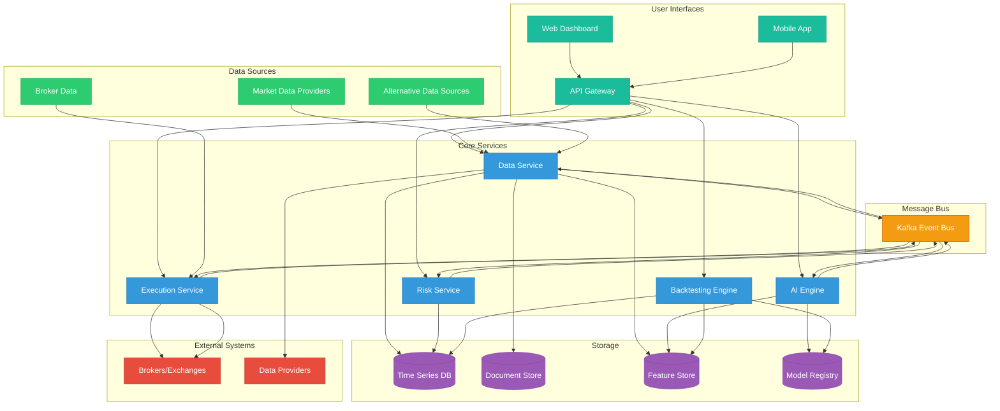
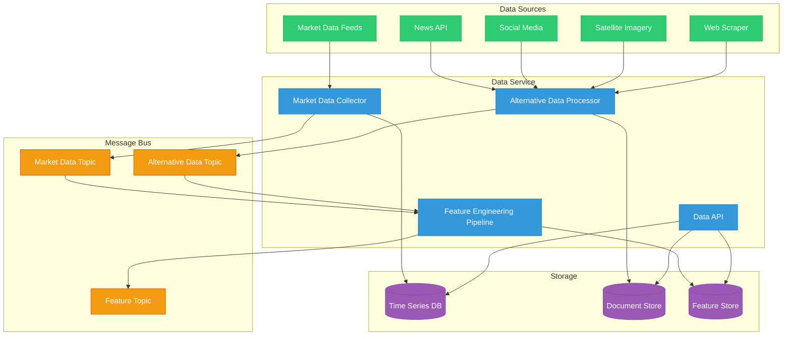
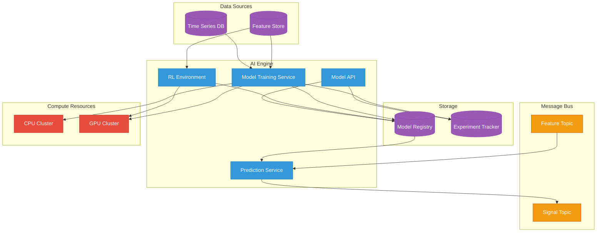
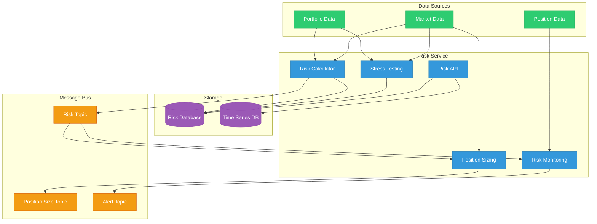
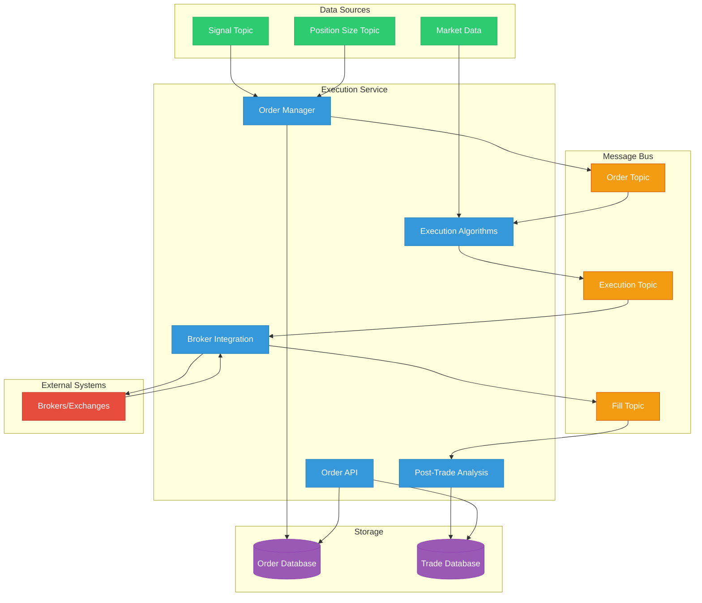
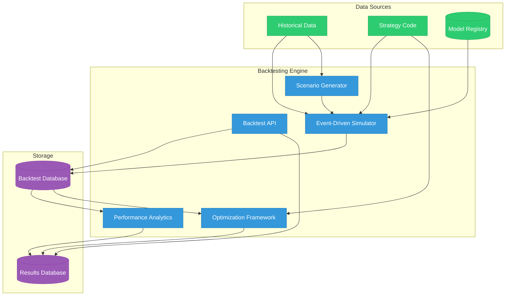
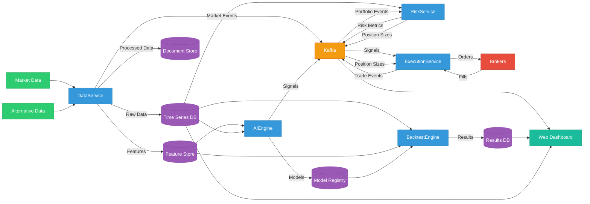
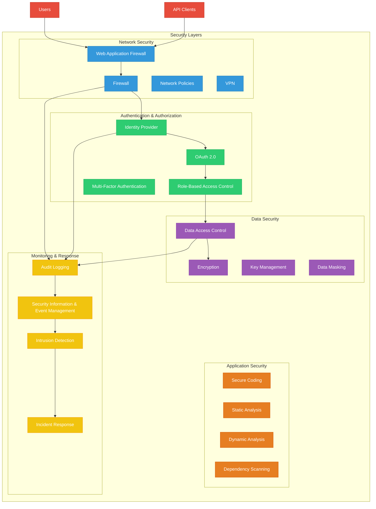

# QuantumAlpha System Component Diagram

This document provides visual representations of the QuantumAlpha system architecture, showing the relationships between different components and services.

## High-Level System Architecture



## Data Service Architecture



## AI Engine Architecture



## Risk Service Architecture



## Execution Service Architecture



## Backtesting Engine Architecture



## Data Flow Diagram



## Deployment Architecture

```mermaid
graph TD
    subgraph "Cloud Provider"
        subgraph "Kubernetes Cluster"
            subgraph "Control Plane"
                API[API Server]
                Scheduler[Scheduler]
                ControllerManager[Controller Manager]
                ETCD[etcd]
            end
            
            subgraph "Worker Nodes"
                subgraph "Node 1"
                    DataPods1[Data Service Pods]
                    AIPods1[AI Engine Pods]
                end
                
                subgraph "Node 2"
                    RiskPods[Risk Service Pods]
                    ExecutionPods[Execution Service Pods]
                end
                
                subgraph "Node 3"
                    BacktestPods[Backtest Engine Pods]
                    WebPods[Web Frontend Pods]
                end
            end
            
            subgraph "Storage"
                PV[Persistent Volumes]
            end
            
            subgraph "Networking"
                Ingress[Ingress Controller]
                ServiceMesh[Service Mesh]
            end
        end
        
        subgraph "Managed Services"
            ManagedDB[Managed Databases]
            ManagedKafka[Managed Kafka]
            ObjectStorage[Object Storage]
            LoadBalancer[Load Balancer]
        end
    end
    
    subgraph "External Systems"
        DataProviders[Data Providers]
        Brokers[Brokers/Exchanges]
        Users[Users]
    end
    
    %% Connections
    LoadBalancer --> Ingress
    Ingress --> WebPods
    Ingress --> API
    
    DataPods1 --> ManagedDB
    AIPods1 --> ManagedDB
    RiskPods --> ManagedDB
    ExecutionPods --> ManagedDB
    BacktestPods --> ManagedDB
    
    DataPods1 --> ManagedKafka
    AIPods1 --> ManagedKafka
    RiskPods --> ManagedKafka
    ExecutionPods --> ManagedKafka
    
    DataPods1 --> ObjectStorage
    AIPods1 --> ObjectStorage
    BacktestPods --> ObjectStorage
    
    DataPods1 --> DataProviders
    ExecutionPods --> Brokers
    Users --> LoadBalancer
    
    %% Style
    classDef k8s fill:#326CE5,stroke:#2654B9,color:white
    classDef node fill:#3498db,stroke:#2980b9,color:white
    classDef pod fill:#2ecc71,stroke:#27ae60,color:white
    classDef storage fill:#9b59b6,stroke:#8e44ad,color:white
    classDef network fill:#e67e22,stroke:#d35400,color:white
    classDef managed fill:#f1c40f,stroke:#f39c12,color:white
    classDef external fill:#e74c3c,stroke:#c0392b,color:white
    
    class API,Scheduler,ControllerManager,ETCD k8s
    class "Node 1","Node 2","Node 3" node
    class DataPods1,AIPods1,RiskPods,ExecutionPods,BacktestPods,WebPods pod
    class PV storage
    class Ingress,ServiceMesh,LoadBalancer network
    class ManagedDB,ManagedKafka,ObjectStorage managed
    class DataProviders,Brokers,Users external
```

## Security Architecture



## CI/CD Pipeline

```mermaid
graph LR
    subgraph "Development"
        Code[Code Repository]
        PR[Pull Request]
    end
    
    subgraph "CI Pipeline"
        Build[Build]
        UnitTest[Unit Tests]
        IntegrationTest[Integration Tests]
        StaticAnalysis[Static Analysis]
        SecurityScan[Security Scan]
        Artifact[Artifact Repository]
    end
    
    subgraph "CD Pipeline"
        Deploy_Dev[Deploy to Dev]
        E2ETest[End-to-End Tests]
        Deploy_Staging[Deploy to Staging]
        UAT[User Acceptance Tests]
        Deploy_Prod[Deploy to Production]
    end
    
    subgraph "Monitoring"
        Metrics[Metrics Collection]
        Alerts[Alerts]
        Dashboards[Dashboards]
    end
    
    %% Flow
    Code --> PR
    PR --> Build
    Build --> UnitTest
    UnitTest --> IntegrationTest
    IntegrationTest --> StaticAnalysis
    StaticAnalysis --> SecurityScan
    SecurityScan --> Artifact
    
    Artifact --> Deploy_Dev
    Deploy_Dev --> E2ETest
    E2ETest --> Deploy_Staging
    Deploy_Staging --> UAT
    UAT --> Deploy_Prod
    
    Deploy_Prod --> Metrics
    Metrics --> Alerts
    Metrics --> Dashboards
    
    %% Style
    classDef dev fill:#3498db,stroke:#2980b9,color:white
    classDef ci fill:#2ecc71,stroke:#27ae60,color:white
    classDef cd fill:#9b59b6,stroke:#8e44ad,color:white
    classDef monitor fill:#f1c40f,stroke:#f39c12,color:white
    
    class Code,PR dev
    class Build,UnitTest,IntegrationTest,StaticAnalysis,SecurityScan,Artifact ci
    class Deploy_Dev,E2ETest,Deploy_Staging,UAT,Deploy_Prod cd
    class Metrics,Alerts,Dashboards monitor
```



These diagrams provide a visual representation of the QuantumAlpha system architecture, showing the relationships between different components and services. They can be rendered using Mermaid.js or any compatible Markdown renderer that supports Mermaid diagrams.

